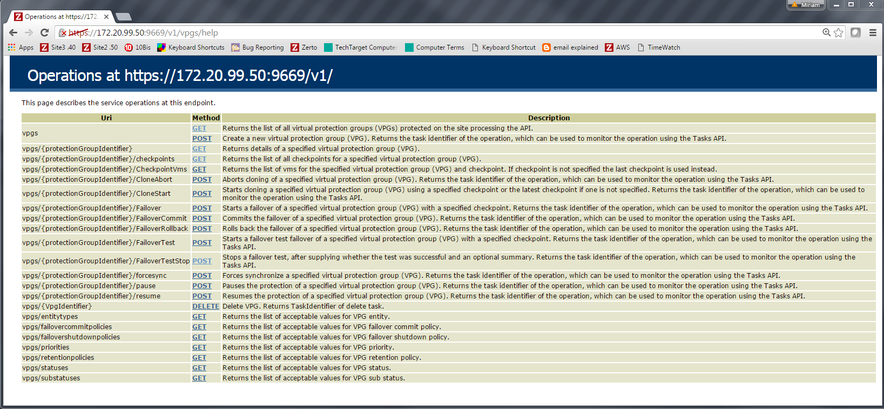

# Introduction to the Zerto Virtual Replication RESTFUL APIs

The Zerto Virtual Replication RESTful API enables you to manage Zerto Virtual Replication programmatically. The REST APIs provide a way to automate many of the tasks required to manage DR, without having to use the Zerto User Interface. For related documentation, refer to myZerto > [Technical Documentation](https://www.zerto.com/myzerto/technical-documentation/)

# Using the APIs

All APIs are exposed over HTTPS.

Most of the Zerto Virtual Replication RESTful APIs require a session running with basic authorization. The username and password authorization used must be a valid username and password either for the Windows machine where the Zerto Virtual Manager is installed or for the hypervisor manager, VMware vCenter Server or Microsoft SCVMM, accessed by the Zerto Virtual Manager. In both cases the Zerto Virtual Manager is the Zerto Virtual Manager where the APIs will run.

The following APIs can be called without any authentication:

- Listing the RESTful APIs, described in Listing the Available APIs and “/v1/ API”, on page 29.
- Getting help for an API, described in Getting Help for an API.
- Generating a resource report about the virtual machines being protected to a recovery site, using the ResourcesReport API, described in “Managing vCD APIs”, on page 247.

When passing a URL in a browser, you require a security certificate. In Microsoft Internet Explorer you have to be in Compatibility mode.

To test the APIs, Zerto recommends using a REST client, such as the following:

- For Google Chrome: [Postman](http://www.getpostman.com/)
- For Microsoft Internet Explorer and Mozilla FireFox: [RESTClient](http://www.restclient.org)

## Starting a Session

Using the user and password either for the Windows machine where the Zerto Virtual Manager is installed or for the hypervisor manager, VMware vCenter Server or Microsoft SCVMM, accessed by the Zerto Virtual Manager, you can establish a session by posting the following URL:

```http
https://zvm_ip:port/v1/session/add
```

A session identifier, x-zerto-session, is returned as part of the response header and the session is established. The session identifier is used in the client code with every API call for the duration of the session.

The APIs can be consumed by applications implemented in different technologies in a stateless manner.
Data returned is formatted either as JSON or as XML as set by the consumer. By default, data that is returned for the v1 APIs is formatted as JSON.

## Listing the Available APIs

Running the following API returns a list of available APIs under /v1:

```http
https://zvm_ip:port/v1/
```

The following output is generated:

```http
[{"href":"https:\/\/10.100.0.51:9669\/v1\/events","rel":"down","type":"IEventsService"},{"href":"https:\/\/10.100.0.51:9669\/v1\/vpgs","rel":"down","type":"IVpgService"},{"href":"https:\/\/10.100.0.51:9669\/v1\/vms","rel":"down","type":"IVmService"},{"href":"https:\/\/10.100.0.51:9669\/v1\/vras","rel":"down","type":"IVraService"},{"href":"https:\/\/10.100.0.51:9669\/v1\/peersites","rel":"down","type":"IPeerSitesService"},{"href":"https:\/\/10.100.0.51:9669\/v1\/session","rel":"down","type":"ISessionService"},{"href":"https:\/\/10.100.0.51:9669\/v1\/tasks","rel":"down","type":"ITasksService"},{"href":"https:\/\/10.100.0.51:9669\/v1\/serviceprofiles","rel":"down","type":"IServiceProfilesService"},{"href":"https:\/\/10.100.0.51:9669\/v1\/virtualizationsites","rel":"down","type":"IVirtualizationSitesService"},{"href":"https:\/\/10.100.0.51:9669\/v1\/zorgs","rel":"down","type":"IZorgsService"},{"href":"https:\/\/10.100.0.51:9669\/v1\/localsite","rel":"down","type":"ILocalSiteService"},{"href":"https:\/\/10.100.0.51:9669\/v1\/alerts","rel":"down","type":"IAlertsService"}]
```

Where:

| parameter | Description |
|---|---|
| zvm_ip | The IP address of the Zerto Virtual Manager where the API is run. |
| port | The port to access the Zerto Virtual Manager. The default port is 9669. |
| href | The URL used. |
| rel | The next path level for the API relative to the current path. |
| type | The API interface service. |

## Filtering Information Retrieved By an API

Information retrieved by many of the APIs can be filtered. The filter parameters are optional and any combination of these parameters is valid. When more than one filter is applied, the AND operand is used. The Help page lists the filters for a specific API. For details, refer to Getting Help for an API.

## Getting Help for an API

Help about each v1 API is available, using the following URL:

```http
https://zvm_ip:port/v1/API/help
```

Where:

| parameter | Description |
|---|---|
| zvm_ip | The IP address of the Zerto Virtual Manager where the API is run. |
| port | The port to access the Zerto Virtual Manager. The default port is 9669. |
| API | The name of the API for which help is required, for example events or vras. |

The available methods are returned. For example, the vpgs API has the following response:

[](images/Help1.jpg)


# Managing VPGs

